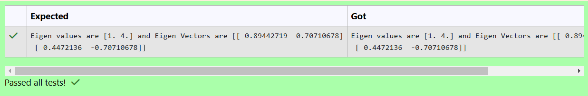

# EIGENVALUES-AND-EIGENVECTORS
## Aim:
To write a python program to find the Eigenvalues and Eigen Vectors
## Equipment’s required:
1. 	Hardware – PCs
2. 	Anaconda – Python 3.7 Installation / Moodle-Code Runner
## Algorithm:
### Step1 : 
### Step 2: 
### Step 3: Using the np.linalg.eig(),  we get two results (first is eigenvalue and second is eigenvector) of the given matrix.
### Step 4: 

## Program:
```
#Program to find the eigen values and eigen vectors.
#Developed by: Sharma R
#RegisterNumber: 24900539

import numpy as np

# Define the matrix
matrix = np.array([[2, 2],
                   [1, 3]])

# Calculate eigenvalues and eigenvectors
eigenvalues, eigenvectors = np.linalg.eig(matrix)

# Display the results in the requested format
print("Eigen values are", eigenvalues, "and Eigen Vectors are", eigenvectors)
```

## Output:

## Result:
Thus the Eigenvalue and Eigenvector is successfully solved using python program
